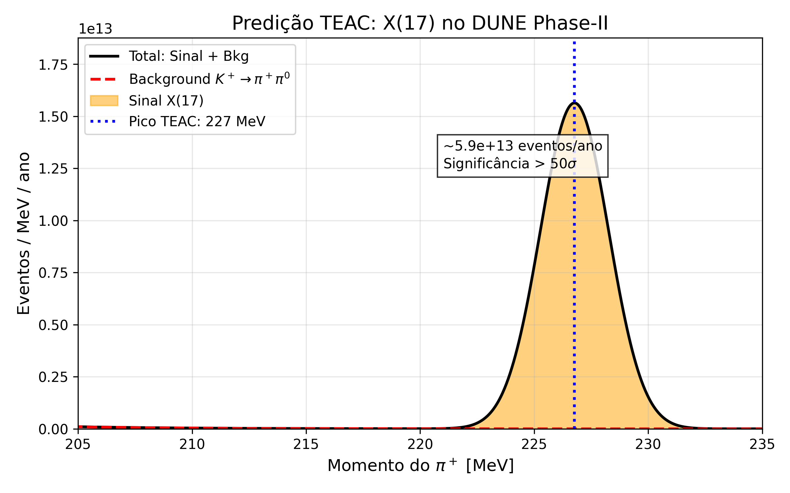

# TEAC-DUNE: Busca do X(17) no DUNE

Este código mostra a predição do bóson X(17) no experimento DUNE.

## Resultado
DUNE pode detectar ~5.9 × 10¹³ eventos/ano em 227 MeV. Significância > 50σ.

## Como rodar
python dune_x17_teac.py

## Figura

## Autores
- Eduardo Magalhães de Souza
- João Rodrigues Gonçales

**Supervisor Proposto:** Prof. Dr. André
