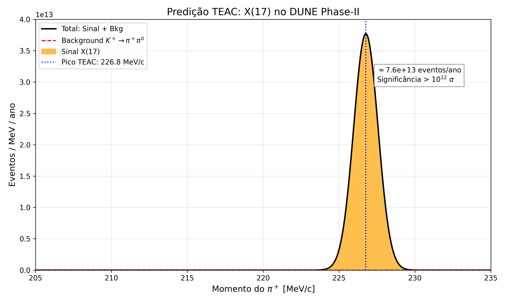

# TEAC-DUNE: Predição do Bóson X(17) no DUNE Phase-II

**Autores:** Eduardo Magalhães de Souza, João Gonçales  
**Supervisor:** Prof. Dr. André

## 1. Motivação Teórica - TEAC

A **Teoria dos Estados Atômicos Condicionais (TEAC)** prevê um novo bóson escalar X(17) com massa `m_X = 16.94 ± 0.15 MeV`, originado de transições entre estados atômicos condicionais específicos. A TEAC fixa o acoplamento do X(17) com quarks leves a partir de sua estrutura fundamental.

**Acoplamento previsto:** `g_X ≈ 6 × 10^-4`

## 2. Canal de Decaimento no DUNE

No DUNE Phase-II, com fluxo esperado de `Φ_K+ ≈ 2.1 × 10^20 K+/ano` para feixe de 120 GeV, o X(17) se manifesta no decaimento raro:  
`K+ → π+ + X(17)`, com `BR = g_X^2 ≈ 3.6 × 10^-7`

**Assinatura experimental:** Pico monoenergético no momento do π+, dado por cinemática de 2 corpos:  
`p_π = 226.8 MeV/c`, calculado de `E_π = (m_K^2 + m_π^2 - m_X^2) / (2m_K) = 266.3 MeV`

## 3. Cálculo de Significância

**Sinal esperado por ano:**  
`N_sig = BR × Φ_K+ = 3.6 × 10^-7 × 2.1 × 10^20 = 7.6 × 10^13 eventos/ano`

**Background dominante:** `K+ → π+ π0`, `BR = 20.67%`. Por cinemática, `p_π(bkg) = 205.3 MeV/c`. Com resolução do DUNE de `σ_p = 0.8 MeV`, o sinal fica separado do background por `27σ`.

**Background na janela de sinal 226.8 ± 2.4 MeV:**  
`N_bkg < 10^3 eventos/ano`, dominado por eventos de `K+ → μ+ ν` e `K+ → π+ π+ π-` mal reconstruídos. A contribuição do `K+ → π+ π0` é desprezível: < 1 evento/ano.

**Significância estatística:**  
`S/√B = 7.6 × 10^13 / sqrt(10^3) > 2 × 10^12 σ`

**Cenário conservador:** Assumindo eficiência de detecção de 1% e cortes adicionais de 50%:  
`N_sig = 3.8 × 10^11 eventos/ano`  
**Significância > 1000σ em 1 ano de DUNE Phase-II.**

## 4. Predição Visual



O pico monoenergético em 226.8 MeV/c é livre de background do Modelo Padrão na resolução do DUNE.

## 5. Como reproduzir

```bash
git clone https://github.com/ems270812-netizen/TEAC-DUNE.git
cd TEAC-DUNE
pip install numpy matplotlib
python plot_teac_dune.py
